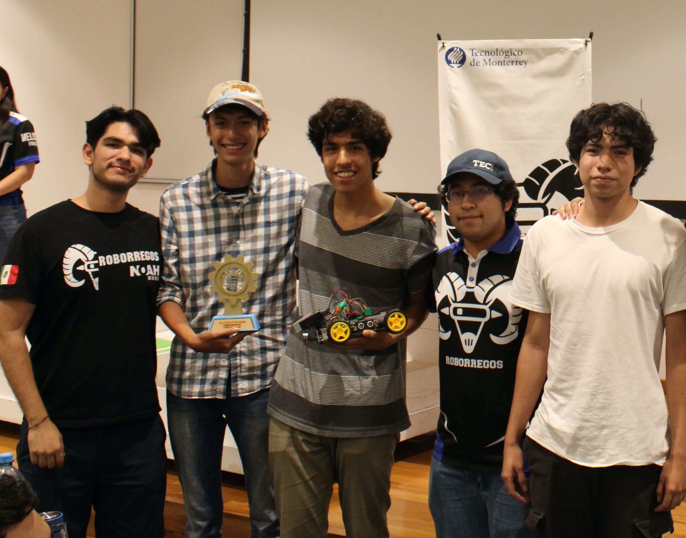

# Roborregos Candidates 2023

Roborregos Candidates 2023 is a robotics and engineering competition to find outstanding students who will join the Roborregos robotics team based on their performance in solving challenges. However, beyond mere selection, the goal is to share robotics knowledge within the Tecnológico de Monterrey community and achieve personal and professional growth for the applicants.

[Official announcement](Candidates_2023.pdf)

<!-- Roborregos social media-->

 

# Competition Day

