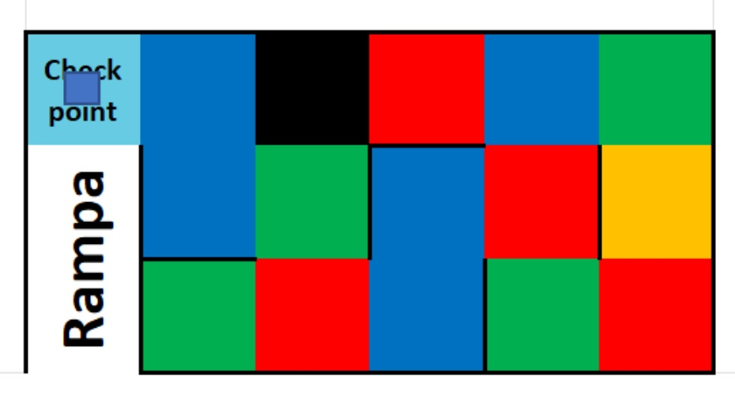
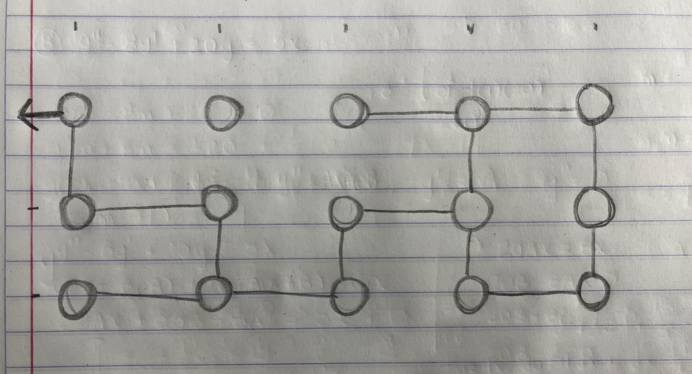

# Algoritmo Zona A
## Resumen
La Zona A es en muy poco detalle simplemente un laberinto. Para poder obtener más puntos en esta zona se debe de recorrer todo el laberinto, con el objetivo de conocer el único color que se repite EXACTAMENTE 5 veces $(U)$. El tamaño del laberinto es siempre una zona de $3\cdot 5$, $+1$ contando la casilla del checkpoint de salida $(E)$. Adicionalmente, hay una casilla negra $(K)$, por la cuál no se debe pasar.

Debido a esto, la cuenta de los colores son:

| Color | Apariciones |
| :-: | :-: |
| Unique $(U)$ | $5$ |
| $A$ | $0 \rightarrow 9$ |
| $B$ | $0 \rightarrow 9$ |
| Black $(K)$ | $1$ |
| Start $(S)$ | $1$ |
| | |
| Total | $16$ |

Donde la aparición de los colores $A+B=9$ y el checkpoint final $E$ puede ser $E\in A|E\in B|E\in C$.

El problema radica en posibles paredes flotantes colocadas de manera aleatoria a lo largo del laberinto. Pueden haber dead ends. Se asegura que siempre existirá una salida del laberinto sin conflicto con $K$ o un dead end.

## Algoritmo: Grafo

### Planteamiento

El sistema completo se puede ver como un grafo que puede o no tener conexiones entre sus diferentes vertices, dependiendo de la existencia de las paredes flotantes. Considerando que pueden existir estas paredes, cada vértice se conecta con otro siempre de manera octogonal, por lo que un vértice puede tener máximo 4 vértices adyacentes. Considerando el laberinto en la convocatoria:

<div style="text-align: center;">


</div>

Se requiere un algoritmo que explore todos los vértices, incluso si se llega a encontrar la casilla de salida $(E)$. Esto se debe a que primero se tiene que determinar el color que tiene exactamente 5 apariciones $(U)$. El vértice $K$ no se debe acceder y por tanto no deben de existir caminos hacia el mismo.

### Depth First Search (DFS)
DFS es un algoritmo para atravesar o buscar vértices a través de grafos. A diferencia de otros algoritmos, como el BFS (Breath First Search), recorre el grafo conforme va encontrando nuevos vértices. Es decir, cuando encuentra un nuevo vértice, lo empieza a explorar en ese momento y pausa la exploración del vértice anterior para más adelante.

Esta pausa se puede implementar de dos maneras diferentes:
* Recursividad: A través de recursividad se repite el proceso de búsqueda de vértices adyacentes para cada vértice que encuentra. 
    1. La función de búsqueda sobre un vértice padre encuentra un vértice hijo.
    1. Por ser encontrado, la función se llama sobre el vértice hijo, efectivamente pausando la del vértice padre.
    2. Cuando este vértice hijo se exploró completamente, la función termina. 
    3. Se reanuda la función de exploración del vértice padre.

* Stack: Se crea esta estructura de tipo *stack* y se van añadiendo y eliminando vértices del mismo según se vayan encontrando y explorando vértices: cuando se añade un vértice al stack se pausa su exploración y cuando se elimina se reanuda.


###  Desarrollo de eficiencia particular
Debido a que estamos atados a un medio físico, donde se van encontrando vértices conforme el robot explora el laberinto, se prefiere un algoritmo donde se requiera la menor cantidad de aristas para visitar todos los vértices (i.e.: se recorra la menor distancia para visitarlos todos.) Por ello se debe elegir un algoritmo que no regrese por los vértices y aristas por los que ya pasó a menos que sea necesario.

Se puede alcanzar mayor eficiencia al:

1. Guardar al inicio un hashmap de vértices ```max_v``` con la cantidad máxima de aristas o conexiones de cada vértice con otros (i.e.: cantidad máxima de veces que se puede encontrar un vértice desde diferentes vértices), donde:
    * Llave: vértice $y$
    * Valor: cantidad máxima de aristas $x$
2. Guardar con cada exploración un hashmap de vértices ```found_v``` con la cantidad de aristas o conexiones que cada vértice tiene con otros al momento (i.e.: cantidad de veces que se ha encontrado el vértice desde otros diferentes vértices hasta el momento), donde:
    * Llave: vértice $y$
    * Valor: cantidad de aristas encontradas al momento $a$
3. Comparar ambos valores con cada visita a $y$.
    * Si $x=a$, ya no es necesario explorar $y$ debido a que ya no puede tener más conexiones. $y$ se marca como explorado y no es necesario visitarlo en un futuro.


Tomando en cuenta el anterior razonamiento, se puede alcanzar mayor eficiencia si se plantea un peso para cada arista que corresponda con el nivel de profundidad del grafo de derecha a izquierda. El objetivo es marcar como visitados y explorados la mayor cantidad de vértices a la derecha del laberinto antes de avanzar hacia la izquierda. Por ello, se prioriza explorar vértices encontrados con la siguiente jerarquía:

| Dirección | Peso |
| :-: | :-: |
| Derecha | $-1$ |
| Abajo o Arriba | $0$ |
| Izquierda | $1$ |

Donde los números con menor peso tienen mayor prioridad.

Debido a las consideraciones únicas mencionadas anteriormente, será mejor que se puedan modificar los vértices a explorar según convenga. Por ello, el algoritmo que involucra stack se utiliza sobre el algoritmo de recursividad. El stack puede ser modificado a conveniencia considerando las prioridades de exploración de vértices de manera más sencilla que el algoritmo recursivo.

### Implementación de Grafo en C++

Para mantener un orden en el programa principal se va a crear un nuevo archivo que contenga la definición de una clase ```Graph```. Esta estructura se va a utilizar para almacenar las casillas (vértices) que recorre el robot. Los elementos básicos que debe contener son:

```cpp
class Graph {
    private:
        // Number of vertices
        int num_v;
        // Vertex position of robot
        int pos;
        // Adjacency list (edges of each vertex)
        vector<int> adj[num_v];

    public:
        // Constructors
        Graph(int v);
        // Add an undirected edge between two vertices
        void addEdge(int v1, int v2);
};
``` 

### Escalabilidad


## Dudas y suposiciones
1. ¿Cuál es el mínimo y máximo número de apariciones de un color en las casillas? ¿Puede un color no aparecer, o incluso llegar a aparecer más de 5 veces?
    * Se supone que un color puede no aparecer o aparecer todas las veces posibles mientras permita que otro tenga exactamente 5 apariciones.
2. ¿El color aleatorio del checkpoint al final de la Zona A (inicio de la rampa) cuenta para el número de apariciones de un color? ¿Por qué en la convocatoria aparece con un azul más claro?
    * Se supone que si se incluye en la cuenta y que el color cambia para que haga contraste con la representación del cubo en la imagen.

## Referencias

[Convocatoria oficial](../Candidates%202023.pdf)

[Pensamiento algorítmico de DFS & BFS](https://www.youtube.com/watch?v=pcKY4hjDrxk&ab_channel=AbdulBari)

[DFS Iterativo](https://www.geeksforgeeks.org/iterative-depth-first-traversal/)