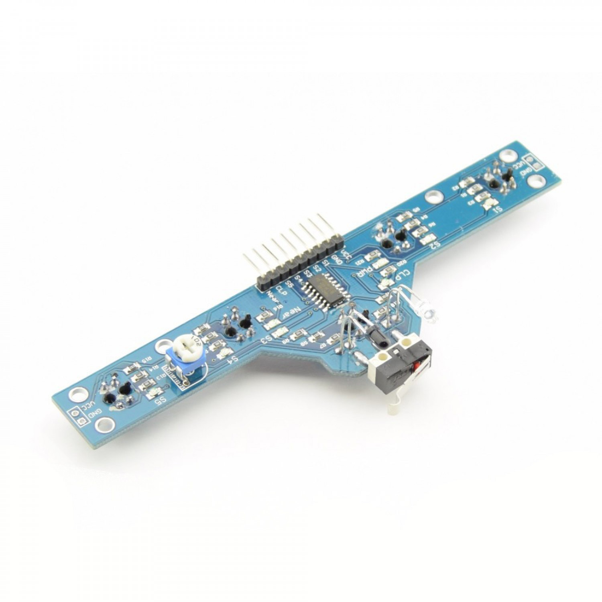
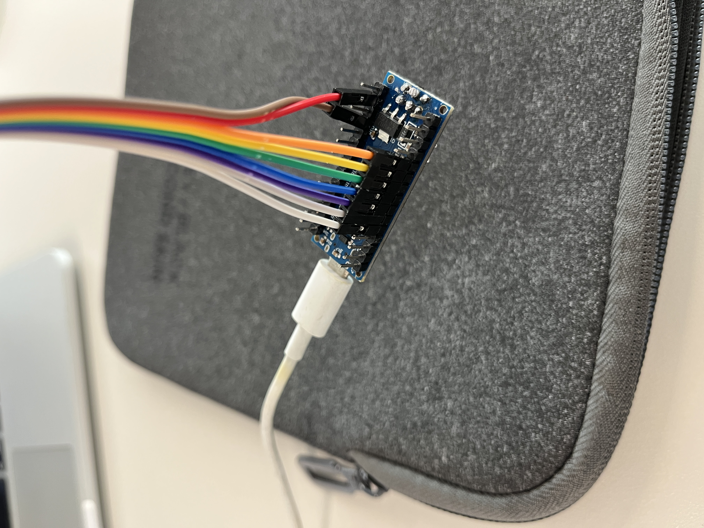
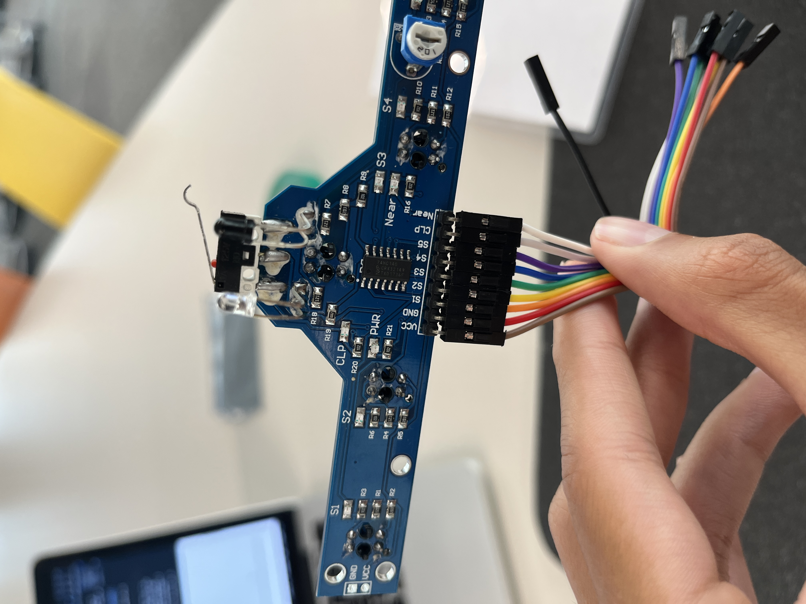
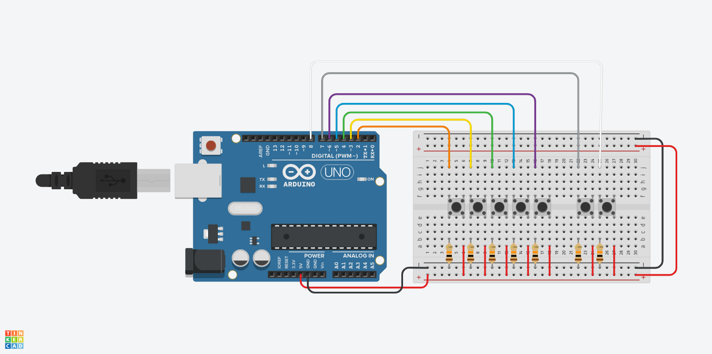
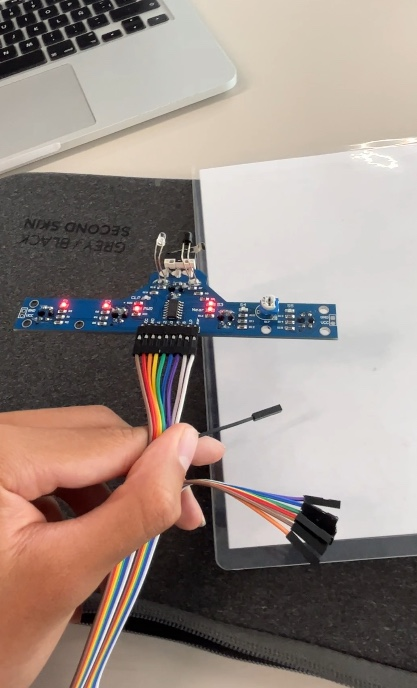

# Prueba del módulo de 5 *TCRT5000*

## Descripción del módulo
* Voltaje: 5V
* Dimensiones: 69 mm x 28 mm
* Cuenta con cinco sensores de reflexión infrarroja TCRT5000
* Pines:
    * VCC: Pin de 5V
    * GND: Pin de tierra
    * S1: Salida digital del sensor 1
    * S2: Salida digital del sensor S2
    * S3: Salida digital del sensor S3
    * S4: Salida digital del sensor S4
    * S5: Salida digital del sensor S5
    * CLP: Salida digital del interruptor frontal
    * NEAR: Salida digital del sensor frontal


<div style="text-align: center">


Módulo de 5 x TCRT5000
</div>

## Conexiones
<div style="text-align: center">


Conexiones en Arduino Nano



Conexiones en Módulo de TCRT5000



Modelación del circuito (con botones)
</div>


## Código
Leyendo la entrada de cada uno de los 5 sensores infrarrojos cada $0.5\  s$ y mostrando su valor booleano en el serial monitor. El valor booleano $0$ se devuelve cuando los rayos infrarrojos no se detectan, lo cual suele ocurrir cuando se apunta el sensor a una gran distancia de cualquier superficie o cuando se apunta a una superficie que no refleja los rayos. El valor booleano $1$ se devuelve cuando los rayos infrarrojos emitidos regresan al sensor, lo cual solo puede ocurrir cuando se emiten sobre una superficie reflectante.

```cpp
int IRS_1 = 2;
int IRS_2 = 3;
int IRS_3 = 4;
int IRS_4 = 5;
int IRS_5 = 6;
int SWITCH = 7;
int IRS_Front = 8;
bool S1, S2, S3, S4, S5, S6, S7;
char strBuf[70];

void setup(){ 
  Serial.begin(9600);

  pinMode(IRS_1, INPUT);
  pinMode(IRS_2, INPUT);
  pinMode(IRS_3, INPUT);
  pinMode(IRS_4, INPUT);
  pinMode(IRS_5, INPUT);
  pinMode(SWITCH, INPUT);
  pinMode(IRS_Front, INPUT);
 }
 
void loop() {
  S1 = digitalRead(IRS_1);
  S2 = digitalRead(IRS_2);
  S3 = digitalRead(IRS_3);
  S4 = digitalRead(IRS_4);
  S5 = digitalRead(IRS_5);
  S6 = digitalRead(SWITCH);
  S7 = digitalRead(IRS_Front);


  Serial.println("S1\tS2\tS3\tS4\tS5");
  sprintf(strBuf, "%d\t%d\t%d\t%d\t%d", S1, S2, S3, S4, S5, S6, S7);
  Serial.println(strBuf);

  
  delay(500);

}
```


## Pruebas
<div style="text-align: center">
<a href="../Figures/IMG_6509.MOV"></a>

Probando los sensores infrarrojos del módulo
</div>


## Referencias
[Descripción del módulo](https://www.tinytronics.nl/shop/en/sensors/optical/infrared/5x-tcrt5000-tracking-and-object-sensor-module)

