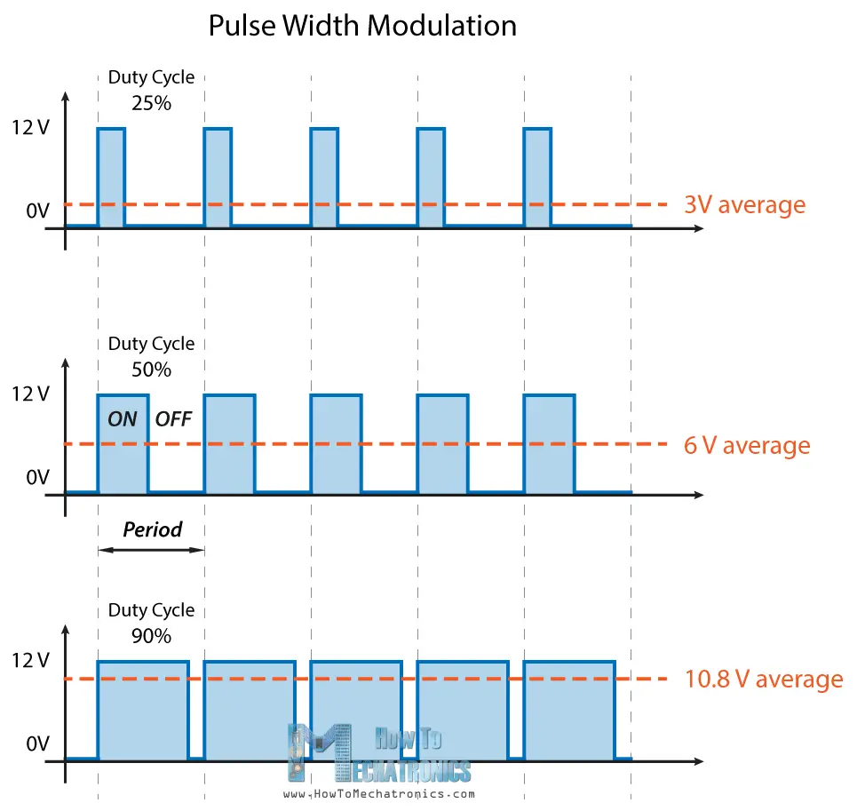

# Yellow Gearbox Motor and *Mini L298N* Driver

## Research

A motor is a device that turns electricity into movement. A common simple motor is a DC brushed motor, often employed in basic robotics projects. These motors function similarly to most others, by directing electrical current through coils that produce a magnetic field in opposition to permanent magnets. The resulting force between the magnetic fields induces the rotor to rotate, generating motion. This rotation can be of up to 17000 rpm.

A yellow gearbox motor consists of, precisely, a brushed DC motor and a gear box. The gear box is vital to increase the torque of the motor, which is the amount of weight it can induce rotation to. As a consequence of increasing this value, the final rpm will only be a fraction of the original brushed motor's.

A motor driver is used to control the most basic elements of a simple motor, such as the yellow DC gear box motors frequently used on simple robots construction. These elements are:

* [Direction](#direction)
* [Speed](#speed)

### Direction

The direction of a motor can be determined by the voltage of the motor's circuit. Given that you can theoretically just connect the VCC and GND into any of both terminals to close the circuit, the voltage can assume a state of $5\ V$ or $-5\ V$. As a consequence of this voltage change, the motor rotates to one direction or another.

A motor driver is useful to control the polarity of the voltage supplied to the motor terminals in order to change its direction. The pins that control this characteristic on the motor driver are the `INPUT_1` and `INPUT_2` pins. These pins should be connected to [PWM (Pulse Width Modulation)](#speed) compatible pins on the Arduino terminal, which will be explained further ahead.

By writing `INPUT_1` to HIGH and `INPUT_2` to LOW, the motor starts to spin in the direction defined by `INPUT_1`. By doing it the other way around, if `INPUT_2` is set to HIGH and `INPUT_1` to low, the direction is inverted. Whenever both pins are set to HIGH or LOW, either none of them provide force or both do, effectively cancelling each other out and producing no net force.

### Speed

The speed of the robot is determined by the net revolutions per minute that the motors are able to supply to the wheels. These in turn provide linear motion to the entire vehicle. Since the motors only know ON/OFF, we have to provide a way to them to modify their behavior so that the average rotations every second equals our desired value. In order to achieve this, PWM is used.

Pulse Width Modulation is, in simple terms, a technique that consists on converting a digital signal into an analog signal, done by providing an average supplied voltage through a certain amount of time.

For example, if voltage is supplied only $7.5\ \text{ms}$ of every $10\ \text{ms}$, we can expect the motor to rotate on average at $75\%$ of its maximum speed considering that the remaining $25\%$ of the time (that it is not being supplied with voltage) is equally distributed through the entire $10\ \text{ms}$. The smaller these time values, the closer the average provided voltage gets to resemble a constant value.

A visual representation of this concept:

## Testing

Both of the described elements altogether allow us to rotate the robot and make it accelerate or slow down.

Since our designed robot has 4 wheels, one single motor driver will be used, each side of the driver for each of the left and right sides of the robot. This decision was made by the reasoning that both left wheels and both right wheels will always rotate in the same direction and in the same speed. This approach considers the necessary motion that facilitates the robot's rotation. This rotation mainly consists on providing inverse voltages to the left wheels than those to the right, in order to make them rotate on inverse directions, ultimately generating the intended torque and motion.

[Test Code](./Motor_Test/Motor_Test.ino)

## References

[L298N Driver](https://www.youtube.com/watch?v=GPVC84D5ULw&ab_channel=MRMS-WORKSHOP)

[Driver Testing](https://howtomechatronics.com/tutorials/arduino/arduino-dc-motor-control-tutorial-l298n-pwm-h-bridge/)

[Reference code](https://www.instructables.com/Tutorial-for-Dual-Channel-DC-Motor-Driver-Board-PW/)
