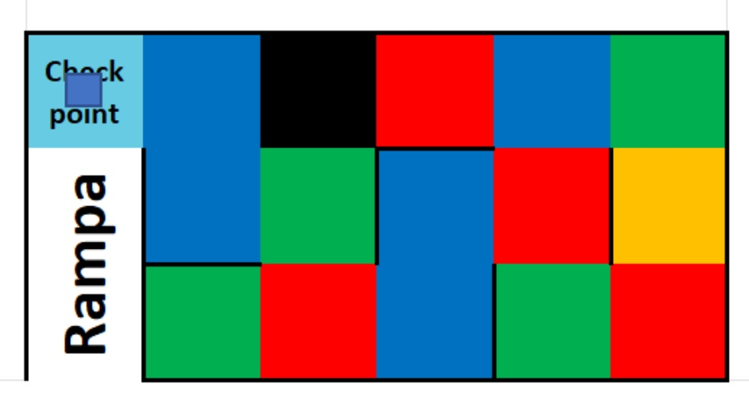

# Algorithm Zone A
## Summary
Zone A is, in very little detail, simply a maze. To earn more points in this zone, one must traverse the entire maze with the objective of identifying the only color that repeats EXACTLY 5 times $(U)$. The size of the maze is always a zone of $3\cdot 5$, $+1$ counting the checkpoint exit square $(E)$. Additionally, there is a black square $(K)$ that should not be crossed.

Because of this, the color count is as follows:

| Color | Appearances |
| :-: | :-: |
| Unique $(U)$ | $5$ |
| $A$ | $0 \rightarrow 9$ |
| $B$ | $0 \rightarrow 9$ |
| Black $(K)$ | $1$ |
| Start $(S)$ | $1$ |
| | |
| Total | $16$ |

Where the appearance of colors $A+B=9$ and the final checkpoint $E$ can be $E\in A\ |\ E\in B\ |\ E\in C$.

The problem lies in possible randomly placed floating walls throughout the maze and possible dead ends. It is ensured that there will always be an exit from the maze without conflict with $K$ or a dead end.

## Questions and Assumptions
1. What is the minimum and maximum number of appearances of a color in the squares? Can a color not appear, or even appear more than 5 times?
    * It is assumed that a color may not appear or appear as many times as possible while allowing another color to have exactly 5 appearances.
2. Does the random color of the checkpoint at the end of Zone A (start of the ramp) count towards the number of appearances of a color? Why does it appear in the call with a lighter blue?
    * It is assumed that it is included in the count, and the color changes to provide contrast with the representation of the cube in the image.
3. Does the initial square also change in position every round?
    * It is assumed that it changes to a random position as with every other colored square.

## Algorithmic Approach: Graph

The entire system can be seen as a graph that may or may not have connections between its different vertices, depending on the presence of floating walls. Considering that these walls can exist, each vertex is connected to another always in an octagonal manner, so vertices will have a maximum of adjacent vertices possible.

Zone A example maze

Graph representation of maze with vertex names

An algorithm is needed that explores all vertices, even if the exit square $(E)$ is encountered. This is because the color that occurs exactly 5 times $(U)$ must first be determined. Vertex $K$ should not be accessed, and therefore, there should be no paths to it.

## Depth First Search (DFS)
DFS is an algorithm for traversing or searching vertices through graphs. Unlike other algorithms, such as BFS (Breadth-First Search), it traverses the graph as it encounters new vertices. In other words, when it finds a new vertex, it starts exploring it at that moment and pauses the exploration of the previous vertex for later.

This pause can be implemented in two different ways:
* Recursion: Through recursion, the process of searching for adjacent vertices is repeated for each vertex it finds.
    1. The search function on a parent vertex finds a child vertex.
    2. Upon being found, the function is called on the child vertex, effectively pausing the one on the parent vertex.
    3. When this child vertex is fully explored, the function ends.
    4. The function of exploring the parent vertex resumes.

* Stack: This stack data structure is created, and vertices are added to and removed from it as vertices are found and explored. When a vertex is added to the stack, its exploration is paused, and when it is removed, it resumes.

## References

[Official Call](../Candidates%202023.pdf)

[Algorithmic Thinking of DFS & BFS](https://www.youtube.com/watch?v=pcKY4hjDrxk&ab_channel=AbdulBari)

[Iterative DFS](https://www.geeksforgeeks.org/iterative-depth-first-traversal/)
