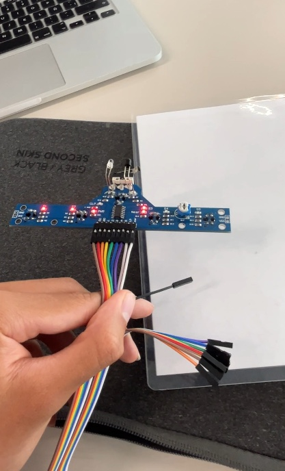

# Testing the *TCRT5000* Module

## Module Description

* Voltage: 5V
* Dimensions: 69 mm x 28 mm
* Features five TCRT5000 infrared reflection sensors
* Pins:
  * VCC: 5V Pin
  * GND: Ground Pin
  * S1: Digital output of sensor 1
  * S2: Digital output of sensor 2
  * S3: Digital output of sensor 3
  * S4: Digital output of sensor 4
  * S5: Digital output of sensor 5
  * CLP: Digital output of front switch
  * NEAR: Digital output of front sensor


TCRT5000 Module

## Connections


Arduino Nano Connections


TCRT5000 Connections


Test Circuit Model

## Code

Reading the input from each of the 5 infrared sensors every $0.5\  s$ and displaying their boolean values on the serial monitor. A boolean value of $0$ is returned when no infrared rays are detected, which usually occurs when the sensor is pointed at a great distance from any surface or when it is pointed at a non-reflective surface. A boolean value of $1$ is returned when the emitted infrared rays bounce back to the sensor, which can only happen when they are emitted onto a close reflective surface.

```cpp
int IRS_1 = 2;
int IRS_2 = 3;
int IRS_3 = 4;
int IRS_4 = 5;
int IRS_5 = 6;
int CLP = 7;
int IRS_NEAR = 8;
bool S1, S2, S3, S4, S5, S6, S7;
char strBuf[80];

void setup(){ 
  Serial.begin(9600);

  pinMode(IRS_1, INPUT);
  pinMode(IRS_2, INPUT);
  pinMode(IRS_3, INPUT);
  pinMode(IRS_4, INPUT);
  pinMode(IRS_5, INPUT);
  pinMode(SWITCH, INPUT);
  pinMode(IRS_NEAR, INPUT);
 }
 
void loop() {
  S1 = digitalRead(IRS_1);
  S2 = digitalRead(IRS_2);
  S3 = digitalRead(IRS_3);
  S4 = digitalRead(IRS_4);
  S5 = digitalRead(IRS_5);
  S6 = digitalRead(SWITCH);
  S7 = digitalRead(IRS_NEAR);

  Serial.println("S1\tS2\tS3\tS4\tS5\tCLP\tNEAR");
  sprintf(strBuf, "%d\t%d\t%d\t%d\t%d\t%d\t%d", S1, S2, S3, S4, S5, S6, S7);
  Serial.println(strBuf);
  Serial.println();

  delay(500);
}
```

## Testing

<a href="https://youtube.com/shorts/zt0X3Zx6c1c"></a>
Testing TCRT5000 Module

## References

[Module Description](https://www.tinytronics.nl/shop/en/sensors/optical/infrared/5x-tcrt5000-tracking-and-object-sensor-module)
